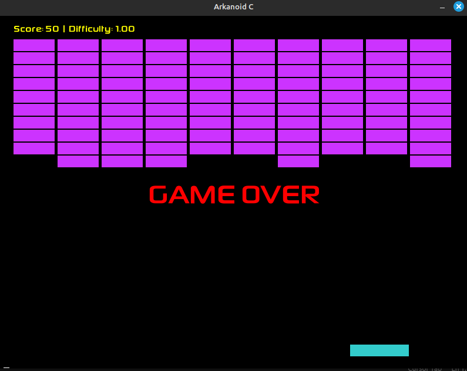

# Arkanoid

Este é um jogo Arkanoid implementado em C com melhorias inteligentes baseadas no algoritmo da **Mediana das Medianas**.

**Número da Lista**: 4<br>
**Conteúdo da Disciplina**: Dividir e Conquistar

## Aluno

| Matrícula | Aluno |
| -- | -- |
| 18/0125974 | [Lucas Rodrigues Monteiro](https://github.com/nickby2) |

## Sobre

Arkanoide é um projeto que implementa um jogo implementado em linguagem C. O objetivo do jogo é utilizar a pá para controlar a bolinha para destruir todos os blocos sem que a bolinha caia fora da pá. 

##  Dividir e Conquistar

O projeto implementa o algoritmo de mediana das medianas cujo o objetivo vai ser criar uma dificuldade do jogo om os frames, em que quando a velocidade da bola vai aumentar ou diminuir conforme a mediana das velocidades. 


## Video de Apresentação

[Apresentação](https://youtu.be/sLzHNpucdaA)


## Screenshots



## Compilação e Execução

### Pré-requisitos
```bash
# Ubuntu/Debian
sudo apt-get install libsdl2-dev libsdl2-ttf-dev


```

### Compilação
```bash
make
```

### Execução
```bash
make run
```

### Limpeza
```bash
make clean
```

